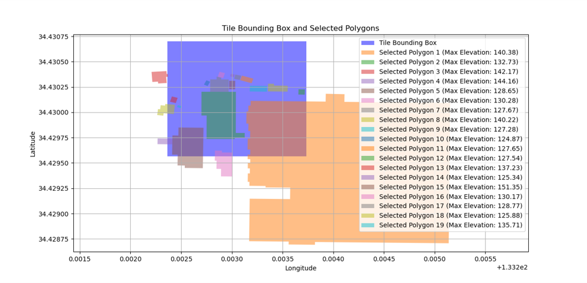
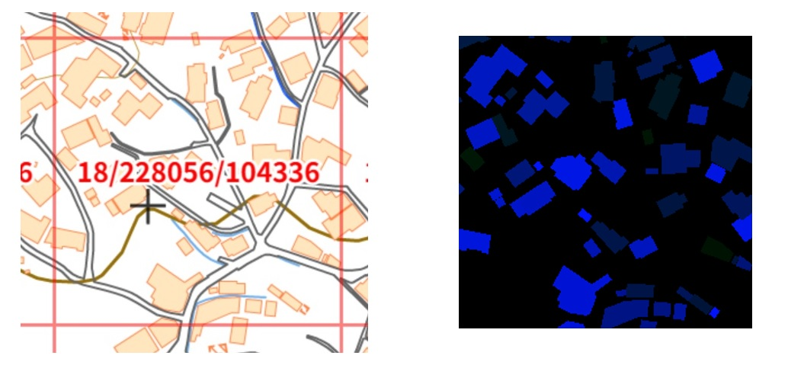
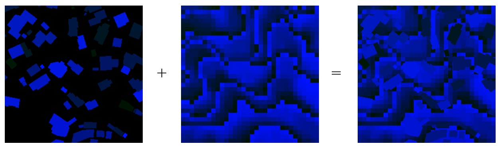

# 「建物標高タイル」試案

## 問題意識「広範囲の3D Tilesは重い！」　　

（参考） [国土地理院「3 次元地図データをウェブ地図に表示するための技術的検討（令和２年度）」](https://www.gsi.go.jp/common/000235797.pdf)  
「調査の結果，3d tiles は広範囲の地図データを提供することには向かないことがわかった．3d tiles は地物数の多い地域や点群の密度が高い箇所はタイルがより細かく分割される仕様のため，画像タイルで一般的に用いられているすべてのタイルが同じ大きさである XYZ 方式とは異なり，タイルデータのファイル名からタイルデータが表示されるべき場所が特定できない．そのため，各タイルデータの位置情報をメタデータで与える仕様となっているが，**広範囲の地図データを提供する場合，メタデータのファイルサイズが大きくなり読み込みに時間がかかってしまうのである  ．**」

## 解決策「建物立体ポリゴンを標高タイル形式にしてしまえば良い！」  
（「建物標高タイル」の作り方）  
- ズームレベル18の、あるタイルに含まれる建物ポリゴンを抽出。

- 当該タイルの各ピクセル（256×256）について、ピクセルが建物ポリゴンを含んでいれば、当該建物の最大標高（maxElv）を当該ポリゴンの標高、含んでいなければ 0m を当該ピクセルの標高として各ピクセルの標高を決定。  
- 国土地理院標高タイル（png形式）のフォーマットに基づきタイルを作成。  

  
- 地理院タイルから同じ位置のズームレベル15の標高タイル（DEM5A）を抽出し、拡大してズームレベル18のタイルを作成。  
  
   
- 両方のタイルを合体して「建物標高タイル」完成

  

- 他のズームレベルはズームレベル18にタイルから逐次作成  

## テストサイト  
https://matsumura-shoichi.github.io/Building_tiles/

## 使用データ  
 [３次元電子国土基本図の試作データ（国土地理院2025年3月21日)](https://www.gsi.go.jp/kibanjoho/kibanjoho61007.html)の内タイル座標（13/7126/3260, 13/7127/3260）のエリア

## 所感「さくさく動く！」  
* 広範囲のデータ配信でも重さは変わらないはず  
* 豆腐モデルの3次元電子国土基本図向き  
* 描画の問題はある（直方体であるべき形状が台形になる）  

## その他  
* 「建物だけ」標高タイルと「地形だけ」タイルを重ね合わせることができれば、もっと綺麗にできるはず（今のところ重ね合わせようとした際にmaplibre-gsi-terrainを使うとエラーになる。）。  
* 「建物だけ」のレンダリングを地形と変更できれば、その方が良いが、地形と同じレンダリングでも地表面を、例えば-10,000mとすれば、シャープな形状になるのではないか。  
